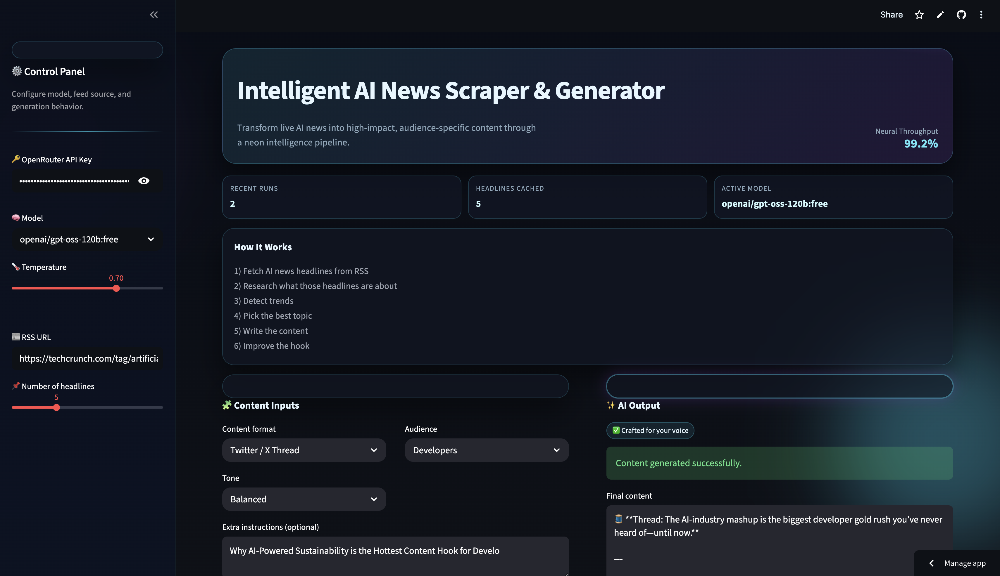
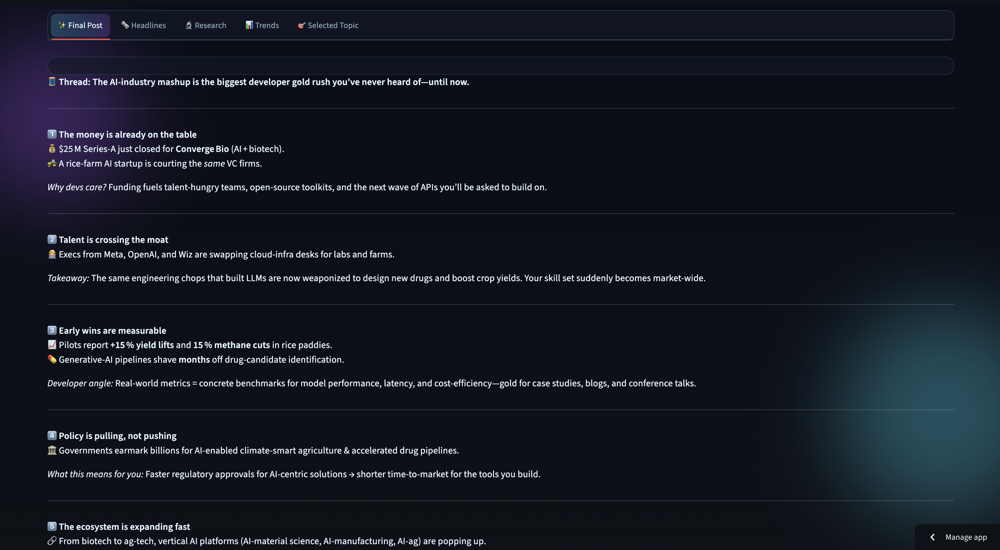

# 🧠 Intelligent AI News Scraper & Generator

> AI-powered content engine that transforms real-time AI news into high-impact posts using a multi-step intelligent pipeline and a premium Streamlit interface.

---

## 🔗 Live Links

🚀 **Live App (Streamlit Cloud)**
👉 https://intelligent-ai-news-scraper-generator-muqeethomer.streamlit.app/

💻 **GitHub Repository**
👉 https://github.com/SyedMuqeeth23/Intelligent-AI-News-Scraper-Generator

---

## 🌟 Overview

## 📸 App Preview

<p align="center">


</p>

**Intelligent AI News Scraper & Generator** is a modern AI-driven content creation system that converts raw AI news into engaging, audience-specific content.

With the rapid growth of AI content tools, this project focuses on turning live news signals into actionable content ideas and polished posts.

### 🎯 This project helps you:

* Simplify content creation
* Automate research & trend detection
* Generate high-quality AI-powered posts
* Deliver a premium, futuristic UI experience

---

## ✨ Features

### 🛰️ Smart News Pipeline

* Fetch real-time AI headlines (RSS feeds)
* Automated research & summarization
* Trend detection using AI
* Best topic selection

### ✍️ AI Content Generation

Generate:

* LinkedIn Posts
* Twitter/X Threads
* Blog Intros
* Newsletter Content

💡 Includes:

* Strong hooks + CTA
* Audience-targeted writing

### 📈 Trend Intelligence

* Detect top 3 emerging trends
* Identify high-potential topics
* AI-powered content strategy

### 🎨 Premium UI/UX

* Neon futuristic theme 🌌
* Glassmorphism design ✨
* Animated pipeline tracker
* Clean tab-based interface

### ⚡ Intelligent Backend

* Multi-step AI pipeline
* Session state management
* Error handling & fallback logic
* Optimized prompt chaining

---

## 🛠️ Tech Stack

* **Frontend:** Streamlit
* **Backend:** Python
* **AI:** OpenRouter (LLMs via LangChain)

### 📚 Libraries Used:

* feedparser
* requests
* langchain_openai

---

## 📂 Project Structure

```
📦 Intelligent-AI-News-Scraper-Generator
 ┣ 📜 agent.py
 ┣ 📜 Ai Content Generator.ipynb
 ┣ 📜 requirements.txt
 ┗ 📜 README.md
```

---

## ⚙️ Installation

### 1️⃣ Clone the repo

```bash
git clone https://github.com/SyedMuqeeth23/Intelligent-AI-News-Scraper-Generator.git
cd Intelligent-AI-News-Scraper-Generator
```

### 2️⃣ Install dependencies

```bash
pip install -r requirements.txt
```

### 3️⃣ Setup environment

Create a `.env` file or use sidebar input:

```
OPENAI_API_KEY=your_api_key_here
```

---

## ▶️ Run the App

```bash
streamlit run agent.py
```

---

## 🧠 How It Works

* Fetches AI news headlines from RSS feeds
* Uses LLM to research and summarize topics
* Detects trends and selects best topic
* Generates audience-specific content
* Optimizes hooks for maximum engagement
* Displays everything in an interactive UI

---

## 📌 Use Cases

* 📱 LinkedIn content creation
* 📰 AI newsletters
* 🧵 Twitter/X threads
* ✍️ Blog writing
* 🚀 Personal branding

---

## 🔮 Future Improvements

* 🤖 Multi-agent debate system
* 🌐 Support multiple RSS sources
* 📄 Export to PDF / Notion
* ⏰ Scheduled content generation
* 📢 Social media auto-posting

---

## 🤝 Contributing

Contributions are welcome!

```
Fork → Branch → Commit → Push → PR
```

---

## 📜 License

This project is open-source and available under the **MIT License**.

---

## 👨‍💻 Author

**Syed Muqeeth Omer Ahmed**
GenAI Builder

---

## ⭐ Support

If you like this project:

⭐ Star this repo
🚀 Share it on LinkedIn
💬 Give feedback

---
